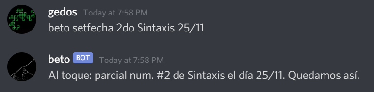
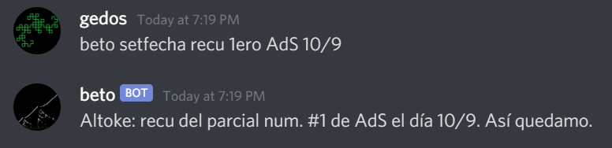
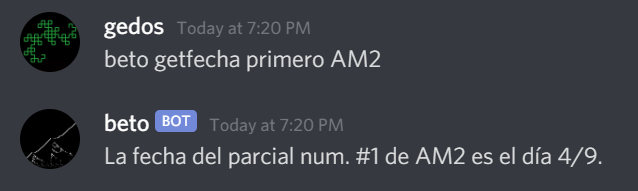
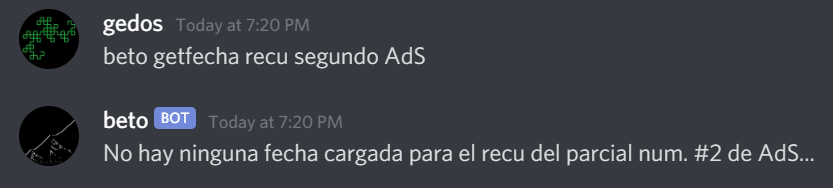

    _Beto assistant_

<hr>

# [English](#beto---english)  
# [Español](#beto---español)

<hr>

# Beto - ESPAÑOL

<hr>

Bot de Discord privado para uso personal que puede recordar definiciones y fechas de exámenes, originalmente pensado para ayduarme a mí y a compañeros de estudio al momento de usar Discord para comunicarnos (y un poco para memear).  

# Comandos y uso  
Usando expresiones regulares _relajadas_ (o sea, nada formal, solo "pseudo expresiones" que transmiten la estructura del comando lo suficientemente bien).  

<hr>

## Ayuda  

#### ``` beto help nombrecomando? ```  
Si no se le pasa ningún ```nombrecomando```, Beto te va a decir todos los comandos que sabe responder.  
De lo contrario, te dice cómo usar el comando sobre el que le estás consultando.  


## Comandos privados
Cada usuario tiene su propio espacio reservado en la Base de Datos para estos comandos, y solo pueden usar su espacio.  

<hr>

#### ``` beto acordate "<cosa>" "<definición>" ```  
Beto se va a acordar lo que sea que llames como "cosa", con la definición que le proveas.  
Los parámetros ```cosa``` y ```definición``` tienen que estar entre comillas dobles, a no ser que sean tokens de una palabra (en ese caso, las comillas son opcionales).  

  
  

#### ``` beto contame (todo|"<cosa>") ```  
Si el mensaje es exactamente ```beto contame todo```, Beto te va a decir todo lo que vos le hayas enseñado con el comando ```acordate```.  
De lo contrario, cambiá ```cosa``` por el nombre de la cosa que quieras saber (case insensitive), y Beto te va a dar la definición que vos le enseñaste.  

  
  
  

De nuevo, las comillas son obligatorias solamente si ```cosa``` no es un token de una palabra.  

## Comandos públicos
Estos comandos modifican información que es común para todos.

<hr>

#### ``` beto setfecha recu? (1|2) <materia> dd/mm ```  
Beto va a agendar una fecha para una instancia de examen si le decís:
- Si es un recuperatorio
- Si es la primera o segunda instancia
  - Sinónimos admitidos para 1: ```primero, primer, 1ero, 1er, 1```
  - Sinónimos admitidos para 2: ```segundo, 2do, 2```
- Nombre de la materia
- Fecha en formado dd/mm (RegExp para la gente curiosa: ```[0-9]{1,2}/[0-9]{1,2}```)  

  


#### ``` beto getfecha recu? (1|2) <materia> ```  
Lo mismo que ```setfecha``` pero sin el parámetro de la fecha.  
Dados todos los parámetros, Beto te va a decir la fecha almacenada con ```setfecha``` para esa instancia (si hay alguna).  

  


<hr>
<hr>

# Beto - ENGLISH

<hr>

Private Discord bot for personal use that remembers definitions and exam dates, thought to help myself and colleagues when using Discord as a main chatting channel for study purposes (and maybe some memeing too).

# Commands and usage
Using _relaxed_ RegExps. (That is, not formal RegExps, just some "pseudo" ones that convey the meaning of the command more directly). 

<hr>

## Help

#### ``` beto help command? ```  
If there is no ```command``` given, Beto will tell you all the commands he can handle.  
Otherwise, he will spit the usage of the command you'd like help for.  


## Private commands
Each user has their own allocated storage for these two commands and can only use their own.  

<hr>

#### ``` beto acordate "<thing>" "<definition>" ```  
Meaning ```beto remember "<thing>" "<definition>"```.  
Beto will remember whatever you name as "thing", with the definition you provide.  
The parameters ```thing``` and ```definition``` should include the double quotes, unless they are single-word tokens (then it's optional).  

  
  

#### ``` beto contame (todo|"<thing>") ```  
Meaning ```beto tell me everything|"<thing>"```.  
If the message is exactly ```"beto contame todo"```, Beto will spit the names of the facts that you have told him using the ```acordate``` command.  
Otherwise, replace ```"thing"``` with the name of one of those facts and Beto will tell you the definition provided by you before.  

  
  
  

Again, double quotes are mandatory only if ```thing``` is not a single-word token.  

## Public commands
These two commands modify information that is common for everyone.

<hr>

#### ``` beto setfecha recu? (1|2) <materia> dd/mm ```  
```Recu``` is short for ```recuperatorio``` which means "make-up exam". Hopefully we won't use that keyword too often.  
```Materia``` means ```subject```.  
Beto will set a date for the exam if you tell him:  
- Is it a make-up?
- Is it the 1st or 2nd instance?
  - Supported values for 1: ```primero, primer, 1ero, 1er, 1```
  - Supported values for 2: ```segundo, 2do, 2```
- Subject name
- Date in dd/mm format (RegExp if you're curious: ```[0-9]{1,2}/[0-9]{1,2}```)  

  


#### ``` beto getfecha recu? (1|2) <materia> ```  
Same as ```setfecha``` but without the date as a parameter.  
Given all those parameters, Beto will tell you what date you saved using ```setfecha``` (if any).  

  

