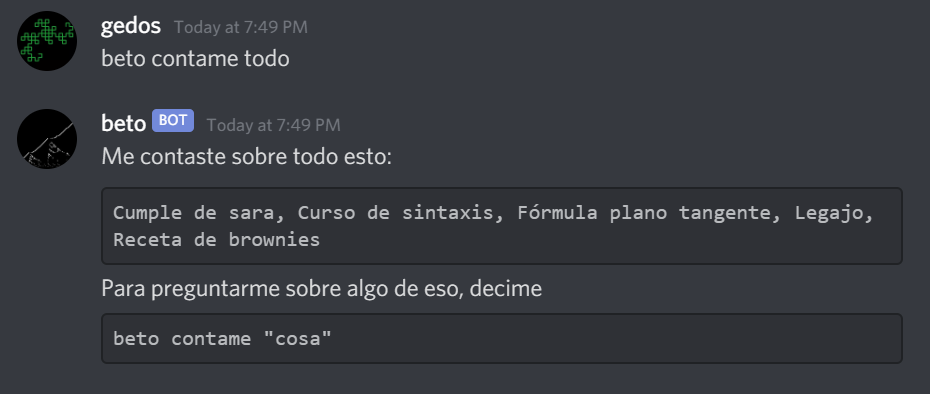

<hr>

- ### [Español](#beto---español)
- ### [English](#beto---english)  

<hr>

# Beto - ESPAÑOL

<hr>

Bot de Discord privado para uso personal que puede recordar definiciones y fechas de exámenes, originalmente pensado para ayduarme a mí y a compañeros de estudio al momento de usar Discord para comunicarnos (y un poco para memear).  

# Comandos y uso  
Usando expresiones regulares _relajadas_ (o sea, nada formal, solo "pseudo expresiones" que transmiten la estructura del comando lo suficientemente bien).  

<hr>

## Ayuda  

#### ``` beto help nombrecomando? ```  
Si no se le pasa ningún ```nombrecomando```, Beto te va a decir todos los comandos que sabe responder.  
De lo contrario, te dice cómo usar el comando sobre el que le estás consultando.  


## Comandos privados
Cada usuario tiene su propio espacio reservado en la Base de Datos para estos comandos, y solo pueden usar su espacio.  

<hr>

#### ``` beto acordate "<cosa>" "<definición>" ```  
Beto se va a acordar lo que sea que llames como "cosa", con la definición que le proveas.  
Los parámetros ```cosa``` y ```definición``` tienen que estar entre comillas dobles, a no ser que sean tokens de una palabra (en ese caso, las comillas son opcionales).  

  
  

#### ``` beto contame (todo|"<cosa>") ```  
Si el mensaje es exactamente ```beto contame todo```, Beto te va a decir todo lo que vos le hayas enseñado con el comando ```acordate```.  
De lo contrario, cambiá ```cosa``` por el nombre de la cosa que quieras saber (case insensitive), y Beto te va a dar la definición que vos le enseñaste.  

  
  
  

De nuevo, las comillas son obligatorias solamente si ```cosa``` no es un token de una palabra.  

## Comandos públicos
Estos comandos modifican información que es común para todos.

<hr>

#### ``` beto agendate DD/MM examen? "evento" "descripción"? ```  
Beto se agenda para el día DD/MM (siendo DD/MM una fecha válida) lo que le digas como "evento", con una descripción opcional.  
Si además incluís la palabra "examen" después de la fecha, se almacena como un examen.  


#### ``` beto mes <num> completo? ```
Beto te muestra todo lo que hay en los próximos días del mes, o el mes entero si le aclarás que lo haga con la palabra "completo".  


#### ``` beto semana (completa|proxima)? ```
Beto te muestra lo que queda de la semana, o la semana entera, o la que viene entera, según lo que le digas.


#### ``` beto regex REGEX PALABRA ```  
Dada una expresión regular REGEX y una palabra PALABRA Beto te dice si anda o no.  
Se pueden usar palabras de más de un token (o usar espacios en la palabra de prueba) usando comillas dobles.  

  


<hr>
<hr>

# Beto - ENGLISH

<hr>

Private Discord bot for personal use that remembers definitions and exam dates, thought to help myself and colleagues when using Discord as a main chatting channel for study purposes (and maybe some memeing too).

# Commands and usage
Using _relaxed_ RegExps. (That is, not formal RegExps, just some "pseudo" ones that convey the meaning of the command more directly). 

<hr>

## Help

#### ``` beto help command? ```  
If there is no ```command``` given, Beto will tell you all the commands he can handle.  
Otherwise, he will spit the usage of the command you'd like help for.  


## Private commands
Each user has their own allocated storage for these two commands and can only use their own.  

<hr>

#### ``` beto acordate "<thing>" "<definition>" ```  
Meaning ```beto remember "<thing>" "<definition>"```.  
Beto will remember whatever you name as "thing", with the definition you provide.  
The parameters ```thing``` and ```definition``` should include the double quotes, unless they are single-word tokens (then it's optional).  

  
  

#### ``` beto contame (todo|"<thing>") ```  
Meaning ```beto tell me everything|"<thing>"```.  
If the message is exactly ```"beto contame todo"```, Beto will spit the names of the facts that you have told him using the ```acordate``` command.  
Otherwise, replace ```"thing"``` with the name of one of those facts and Beto will tell you the definition provided by you before.  

  
  
  

Again, double quotes are mandatory only if ```thing``` is not a single-word token.  

## Public commands
These two commands modify information that is common for everyone.

<hr>

#### ``` beto agendate DD/MM examen? "event" "description"? ```  
Meaning ```beto schedule DD/MM exam? "event" "description"```.  
Beto will add to his ```DD/MM``` (any valid date) schedule whatever you name as ```"event"``` with an optional ```"description"```.  
If you include the keyword ```"examen"``` (exam) after the date, then this will be saved as an exam.  


#### ``` beto mes <num> completo? ```
Meaning ```beto month <num> full?```.  
Beto will show you all of his schedule for the rest of the month, or rather for the full month if you tell him so using the keyword ```completo```.   


#### ``` beto semana (completa|proxima)? ```
Meaning ```beto week (full|next)?```.  
Beto will display whatever is left for this week, or the whole week, or the next one, according to what you command.  


#### ``` beto regex REGEX WORD ```  
Given a regular expression REGEX and a word WORD, Beto will tell you if it's fully recognised or not.  
You can use multi-token words if you enclose them in double quotes.  

  

